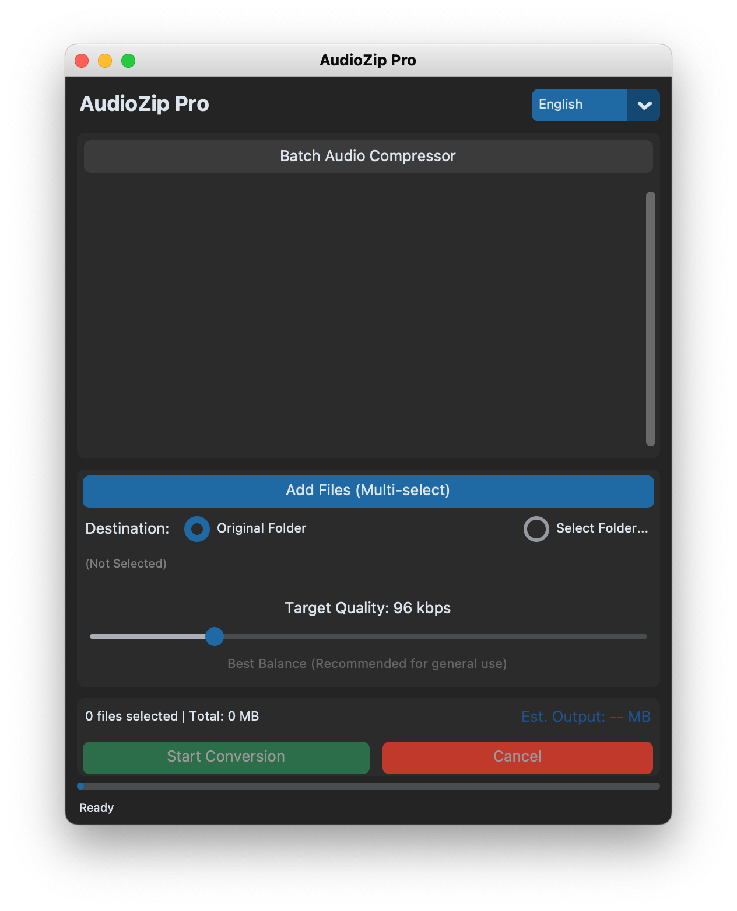

# AudioZip Pro 🎧

AudioZip Pro 是一款輕量且強大的音訊批次壓縮工具。它專為需要快速、大量壓縮錄音檔（如課堂錄音、會議記錄、訪談等）的使用者設計。透過簡單的調整，您可以大幅縮小音訊檔案體積，同時保持適合聽感或 AI 逐字稿辨識的音質。

 *(請在此處上傳您的程式截圖)*

## ✨ 主要特色
- **批次處理：** 一次加入多個檔案，一鍵轉換。
- **智慧預估：** 即時計算壓縮後的預估檔案大小。
- **多語支援：** 提供 繁體中文、English、日本語 介面。
- **品質調整：** 支援 32kbps 到 320kbps 的細膩調整，並附有專業建議提示。
- **跨平台：** 支援 macOS 與 Windows。

## 🚀 快速開始

### 1. 安裝必要組件 (FFmpeg)
本工具的核心功能依賴於 **FFmpeg**。請根據您的作業系統安裝：

- **macOS:**
  ```bash
  brew install ffmpeg
  ```
- **Windows:**
  1. 到 [FFmpeg 官網](https://ffmpeg.org/download.html) 下載預編譯的 Windows 執行檔。
  2. 解壓縮後，將 `bin` 資料夾路徑加入系統環境變數 `PATH` 中。
  3. 或者，將 `ffmpeg.exe` 與 `ffprobe.exe` 直接放在此專案的根目錄下。

### 2. 安裝 Python 函式庫
在終端機或命令提示字元執行：
```bash
pip install -r requirements.txt
```

### 3. 執行程式
```bash
python audiozip.py
```

## 🛠 使用建議 (Bitrate 選擇)
- **64 kbps:** 節省空間首選，適合 AI 語音轉文字辨識，人聲依然清晰。
- **96 kbps:** **推薦平衡點**，檔案小且保留較多音訊細節。
- **128 kbps:** 標準高品質，與原音接近，適合一般聽感需求。

## ⚖️ 授權條款
本專案採用 [MIT License](LICENSE)。

---
*Developed with ❤️ for efficient audio management.*
